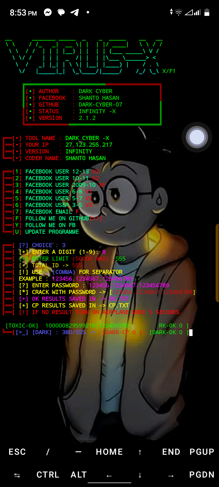

#TERMUX FACEBOOK UID CRACK SC
<p align="center">
<a href="https://github.com/Dark-Cyber-07/SH-CR3K"></a>
</p>
<p align="center">
<a href="https://github.com/Dark-Cyber-07/SH-CR3K"></a>
<a href="https://github.com/Dark-Cyber-07/SH-CR3K"></a>
<a href="https://github.com/Dark-Cyber-07/SH-CR3K"></a>
</p>
<p align="center">
<a href="https://github.com/Dark-Cyber-07/SH-CR3K"></a>
</p>
<p align="center">
<a href="https://github.com/Dark-Cyber-07/SH-CR3K"></a>
<a href="https://youtube.com/c/Dark-Cyber-07"></a>
</p>
<p align="center">
<a href="https://github.com/Dark-Cyber-07"></a>
<a href="https://github.com/Dark-Cyber-07"></a>
<a href="https://github.com/Dark-Cyber-07"></a>
<a href="https://github.com/Dark-Cyber-07"></a>
<a href="https://github.com/Dark-Cyber-07"></a>
<a href="https://github.com/Dark-Cyber-07"></a>
</p>

### AVAILABLE ON :

* Termux
* Linux
* Terminal

### REQUIREMENTS :
* PIP INSTALL REQUIREMENTS
* Storage 100 MB
* req - Git ; pull ; py ; bs4 ; etc


* [+] Easy for Beginners !

## INSTALLATION [Termux] :

* `apt-get update -y`
* `apt-get upgrade -y`
* `pkg install python -y`
* `pkg install git -y`
* `pip install requsts`
* `pip install bs4`
* `git clone https://github.com/Dark-Cyber-07/SH-CR3K`
* `cd $HOME`
* `ls`
* `cd SH-CR3K`
* `git pull`
* `python3 CR3K.py`

```
[+]-- Get Any Types Error Contact Admin  
```
## CONNECT WITH US :

<a href="https://github.com/Dark-Cyber-07"></a>
[](https://www.facebook.com/SHANTO.VAU404)
[](https://t.me/TCW2F)
<a href="https://rebrand.ly/7elzgww"></a>
